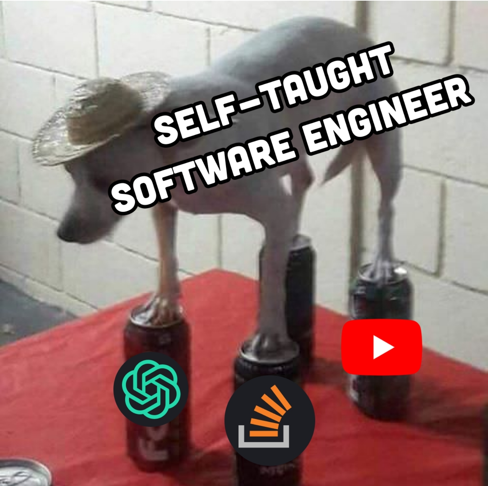

<!---
CGQAQ/CGQAQ is a ✨ special ✨ repository because its `README.md` (this file) appears on your GitHub profile.
You can click the Preview link to take a look at your changes.
--->

- Interested in Rust, C++, and all that kind of stuffs
- A [Chromium](https://chromium-review.googlesource.com/q/owner:cgqaq@chromium.org) committer
- Power <i>Codex</i> user （Used Codex a lot lately)
