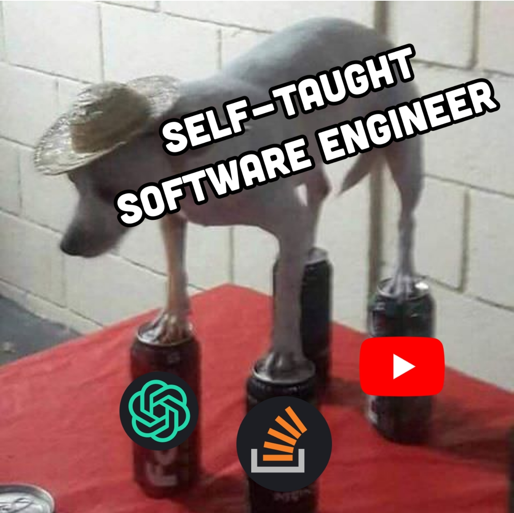

<!---
CGQAQ/CGQAQ is a ✨ special ✨ repository because its `README.md` (this file) appears on your GitHub profile.
You can click the Preview link to take a look at your changes.
--->

- Interested in Rust, C++ and all that kind of stuffs
- A [Chromium](https://chromium-review.googlesource.com/q/owner:m.jason.liu@gmail.com) contributor
- A [Zig](https://github.com/ziglang/zig) enthusiast
- Employed as front-end an engineer right now

   

## 访问量：

